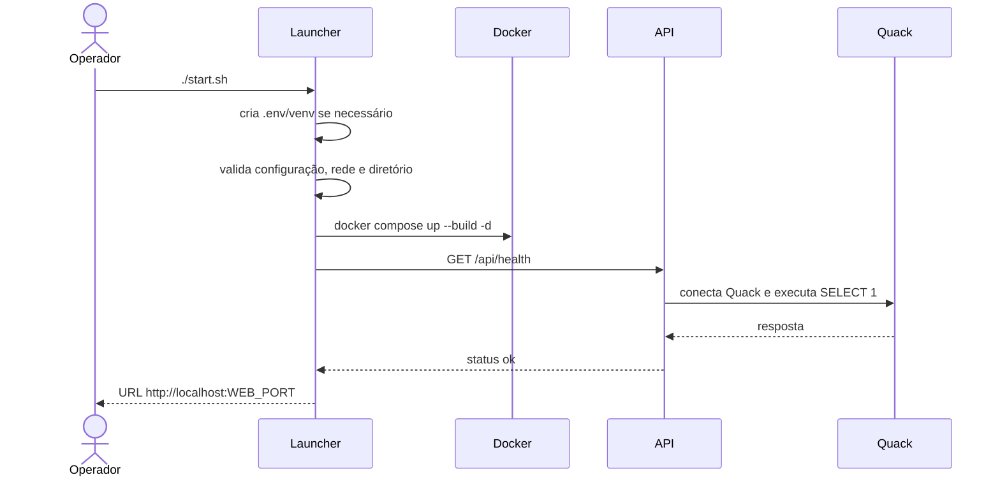
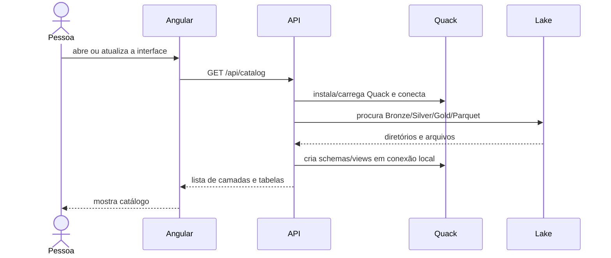
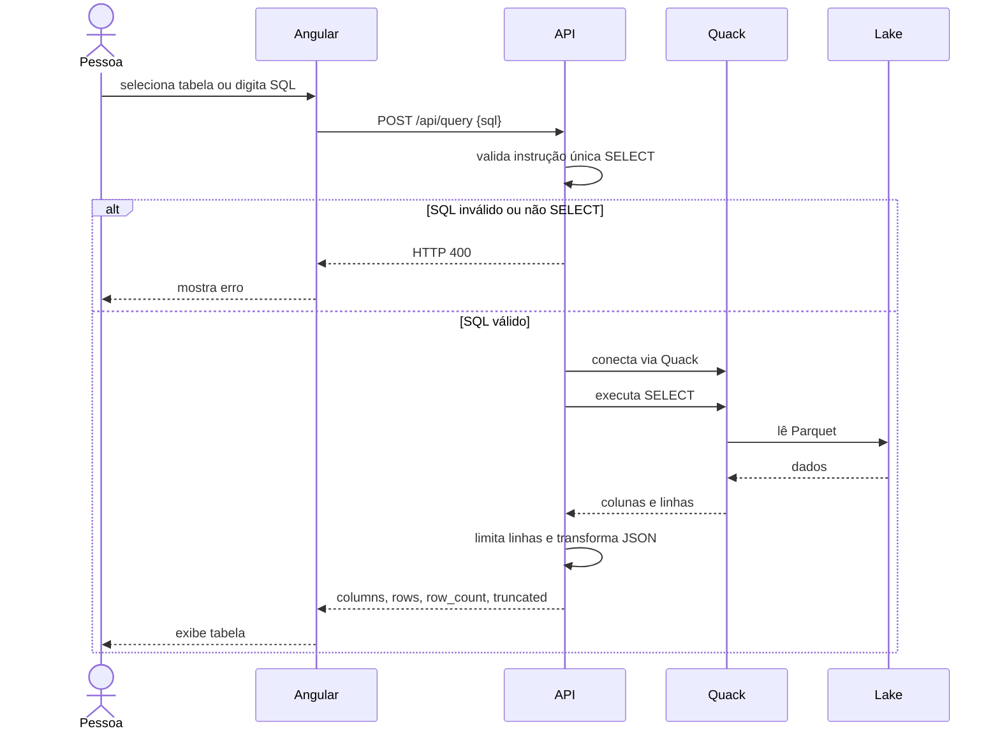
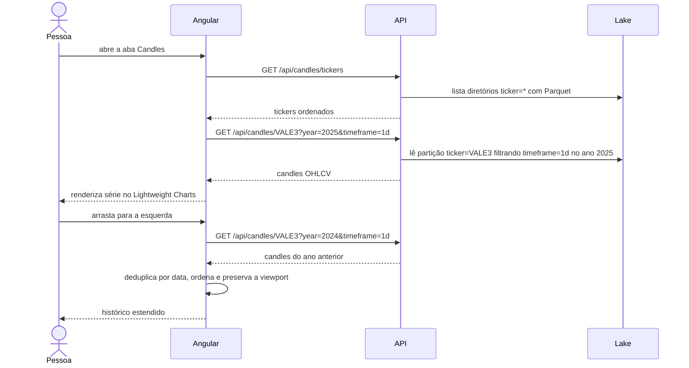

# Diagrama de sequência

## Inicialização e saúde

```mermaid
sequenceDiagram
    actor Operador
    participant Launcher
    participant Docker
    participant API
    participant Quack

    Operador->>Launcher: ./start.sh
    Launcher->>Launcher: cria .env/venv se necessário
    Launcher->>Launcher: valida configuração, rede e diretório
    Launcher->>Docker: docker compose up --build -d
    Launcher->>API: GET /api/health
    API->>Quack: conecta Quack e executa SELECT 1
    Quack-->>API: resposta
    API-->>Launcher: status ok
    Launcher-->>Operador: URL http://localhost:WEB_PORT
```

## Catálogo

```mermaid
sequenceDiagram
    actor Pessoa
    participant Angular
    participant API
    participant Quack
    participant Lake

    Pessoa->>Angular: abre ou atualiza a interface
    Angular->>API: GET /api/catalog
    API->>Quack: instala/carrega Quack e conecta
    API->>Lake: procura Bronze/Silver/Gold/Parquet
    Lake-->>API: diretórios e arquivos
    API->>Quack: cria schemas/views em conexão local
    API-->>Angular: lista de camadas e tabelas
    Angular-->>Pessoa: mostra catálogo
```

## Consulta SQL

```mermaid
sequenceDiagram
    actor Pessoa
    participant Angular
    participant API
    participant Quack
    participant Lake

    Pessoa->>Angular: seleciona tabela ou digita SQL
    Angular->>API: POST /api/query {sql}
    API->>API: valida instrução única SELECT
    alt SQL inválido ou não SELECT
        API-->>Angular: HTTP 400
        Angular-->>Pessoa: mostra erro
    else SQL válido
        API->>Quack: conecta via Quack
        API->>Quack: executa SELECT
        Quack->>Lake: lê Parquet
        Lake-->>Quack: dados
        Quack-->>API: colunas e linhas
        API->>API: limita linhas e transforma JSON
        API-->>Angular: columns, rows, row_count, truncated
        Angular-->>Pessoa: exibe tabela
    end
```

## Gráfico de candles

```mermaid
sequenceDiagram
    actor Pessoa
    participant Angular
    participant API
    participant Lake

    Pessoa->>Angular: abre a aba Candles
    Angular->>API: GET /api/candles/tickers
    API->>Lake: lista diretórios ticker=* com Parquet
    API-->>Angular: tickers ordenados
    Angular->>API: GET /api/candles/VALE3?year=2025&timeframe=1d
    API->>Lake: lê partição ticker=VALE3 filtrando timeframe=1d no ano 2025
    API-->>Angular: candles OHLCV
    Angular-->>Pessoa: renderiza série no Lightweight Charts
    Pessoa->>Angular: arrasta para a esquerda
    Angular->>API: GET /api/candles/VALE3?year=2024&timeframe=1d
    API-->>Angular: candles do ano anterior
    Angular->>Angular: deduplica por data, ordena e preserva a viewport
    Angular-->>Pessoa: histórico estendido
```
